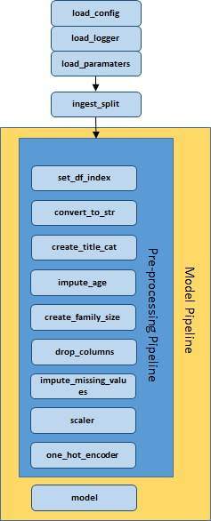

# titanic-mlflow-skl

This repository serves as a prototype for Saint Gobain UK's AI and Machine Learning projects implemented in Python using Scikit-Learn and MLFlow using the [Kaggle Titanic challenge](https://www.kaggle.com/c/titanic). 

The focus isn't the model, but the framework, standards and tools used to structure the project and deploy the model. These are as follows:

* Git feature/branch workflow
* [PEP8](https://www.python.org/dev/peps/pep-0008/) code standards with numpy docstrings
* Abstraction of complex shell commands with `make` via the Makefile
* Reproducibility via a `conda` environment and associated `environment.yaml`
* Managing development and test configurations via the `env.dev` and `env.test` files.
* Separating the application configuration (`.env`), metadata (`parameters.yaml`) and functionality (`src`).
* Tests for functions via `pytest` and test coverage via `coverage`
* Logging generated by `loguru`. This needs replacing (see TODO)
* Plac to simplify the creation of command line execution options.
* Model experimentation and deployment with MLFlow.
* Machine Learning visualisation produced via `yellowbrick` and `scikitplot`

Links to the packages mentioned here can be found in the **Useful Links** section.

Over time, I will be expanding upon these topics with documentation, sessions and tutorials etc. to ensure that the "why", "what" and "how" get properly explained.

## Quickstart
1. Ensure that you have the following software installed:
    * [Windows Subsystem for Linux]() (Through IT)
    * [Anaconda](https://docs.anaconda.com/anaconda/install/)
    * [Git](https://git-scm.com/download/win)
    * [Make](https://www.gnu.org/software/make/)

2. Clone the repository from bitbucket to your local machine: `git clone TBC` and change into the directory by running `cd titanic-mlflow`.

3. Copy the data & configuration files from OneDrive, saved in E:\titanic-data as follows: 
* Save the `env.dev` and `env.test` files into the root of the repository.
* Save the `train_test_raw.csv` and `holdout_raw.csv` files in the `data-dev` directory that you downloaded into the `data/dev` directory. This is the live data used to train and test the model.
* Save the `train_test_raw.csv` and `holdout_raw.csv` files in the `data-dummy` directory that you downloaded into the `data/dev` directory. This is created dummy data used to run the tests on the overall application.

4. Create the sqlite databases to store MLFlow experiments as follows:
* `make create-db-dev`
* `make create-db-test`
This will create two databases in the `db/` directory to store MLFlow experiment data for development and testing respectively.

5. Run `make create-environment` to create the conda environment. This will install the packages listed in the `requirements-conda` and `requirements-pip` directories from `conda` and `pip` respectively and save a full list of package dependencies to `environment.yaml`.

6. To run an experiement run `make run-experiment`. You can update the hyperparameters of the model by changing the appropriate sections in `parameters.yaml`.

7. To start the MLFlow dashboard run `make mlflow-ui`. This will start a webserver for the UI which you can access via `localhost:5001` in your browser.

8. To stage a model for deployment run `make run-deployment`. This will save the model ready to be deployed in the `artifacts/dev/models` directory. Note that the command will error if a model name already exists so you'll need to either delete the model directory in `artifacts/dev/models` or change the `model_name` parameter in `parameters.yaml`.

9. To start the model deployment server run `make mlflow-serve-model`. This will serve the model at `localhost:1235`. This is best accessed through the `query_model_server.ipynb` notebook which contains some pre-baked code to generate a prediction from it.

10. (Optional) To install the environment as a Jupyter kernel run `make create-kernel`. You shouldn't need this to run the notebook in Step 8 however.

11. (Optional) To run the tests run `make tests`. This will run the tests in the `tests` directory using `pytest` and output a coverage report alongside them using `coverage`.

12. (Optional) To install extra packages, update one/both of requirements-conda.txt or requirements-pip.txt with the package names and run the appropriate command:
* `make install-all-requirements`
* `make install-conda-requirements`
* `make install-pip-requirements`
13. (Optional) To remove the environment run `make remove-environment`
14. (Optional) To remove the kernel run `make remove-kernel`

If you don't want to use Make you can run everything manually - the commands in the `Makefile` are all recorded and most will be copy / pasteable into the terminal. Note that you will likely need to replace the environment variables with the actual values to get it to work.

## Overview

The entrypoint for the application is `main.py` in the root of the repository. The application functionality is made up of a number of modules stored in the `src` directory which are explained in more detail below. Complex command line executions are simplified through make and the `Makefile`. Run `make help` for a comprehensive list of these. 

To run an experiment run `make run-experiement`. This can then be seen in the MLFlow UI which can be started via `make mlflow-ui` which will serve the ui on the localhost through the port specified in the configuration. 

To stage a model for deployment, run `make run-deployment`. This can then be deployed with `make mlflow-serve-model` which will serve the model on the localhost through the port specified in the configuration.

The `create_db.py` file is used to create sqlite databases to store MLFlow data. These are stored in the `db` directory. This only needs to be executed once each for the dev and dummy databases.

### Design
The design of the pipeline is as follows:




### ingest_split
This module:
* Imports the `train_test` and `holdout` csv files from the location specified in the `.env.dev` file
* Converts any int columns to floats as int columns can cause problems with regard to missing values (note that this should be included in preprocessing)
* Performs a train_test_split on the `train_test` file

### preprocessing_pipeline
This module creates a scikit-learn preprocessing pipeline to preprocess the data prior to modelling via the `preprocessing.py` file and applies a number of transformations which are recorded as functions in the `transforms.py` with the arguments for the function located in `parameters.yaml`. New transforms can be created and slotted into the pipeline as appropriate.

The transformations in this module must also ship with the model for MLFlow deployment. This ensures that users can pass unprocessed data to the model in order to generate predictions.

### models
This module contains the various models created during experimentation with a separate `.py` file for each model. To switch between, models replace the existing `create_logreg_model()` function in the `main.py` directory with a new function from the `models` module. There are two models at present, Logistic Regression and SVC.

### model_pipeline
This module contains two files. The `evaluate.py` file runs the preprocessing pipeline, fits the model and evaluates it via a number of different scoring methods. The model parameters, evaluation metadata and model is then recorded in MLFlow. The `model_pipeline.py` file appends the model to the preprocessing pipeline to create the overall model pipeline, generates an input signature for the model telling it what format data should be provided in, and formally logs the model with MLFlow for deployment.

### utils
This module contains a single `utils.py` file which contains utility functions to load the configuration from either `.env.dev` or `.env.test`, load the parameters from `parameters.yaml` and create the logger which ouputs logs to the `logs/dev` and `logs/dummy` directories.

## Configuration
The configuration of the application is stored as linux environment variables in the `env.dev` and `env.test` files and passed to the application via the `load_config()` function in the `src.utils` module.. The `artifacts`, `data`, `logs` and `db` folders contain separate directories and files for development and test executions with references to these stored in the `.env.dev` and `.env.test` files.

## Tests
Tests are recorded in the `tests/` directory and when executing them the `.env.test` configuration is used. This ensures that test data, mlflow artifacts and logs are recorded and can be managed separately. Test data has been created to support this and this is stored in the `data/dummy` directory.

Tests can be executed with the command `make tests` and are performed using the `pytest` Python package which automatically runs the tests, and the `coverage` Python package which generates a test coverage report as part of the testing process.

Note that the `dummy` convention has been used for things which might traditionally called `test` to avoid confusion with test data for a Machine Learning model used to validate its accuracy.

## Deployment 
TODO

## Repo Structure
```bash
├── LICENSE
├── Makefile  # Used to simplify command line exeuction
├── README.md
├── artifacts  # Stored MLFlow files
│   ├── dev # Live files created during processing
│   └── dummy # Fake files created during testing.
├── assets  # Stores files associated with the repo
├── create_db.py  # Creates sqlite databases for MLflow
├── data  # Data for the application
│   ├── dev # Live data used for development
│   └── dummy # Fake data used for testing
├── db  # Database files for MLFlow tracking
├── environment.yaml  # Package data for the environment
├── logs  # Logs produced during processing
├── logs-dummy  # Logs produced during testing
├── main.py  # Entrypoint for the application
├── mlruns  # Local store for MLFlow tracking
├── notebooks  # Notebooks storage
├── parameters.yaml  # Parameters for processing
├── query_model_server.ipynb  # Used to test the MLFlow API
├── requirements-conda.txt  # Conda package dependencies
├── requirements-pip.txt  # Pip package dependencies
├── src  # Functaionlity for the application
└── tests  # Tests for the applcation
```

## MLFlow

MlFlow is used to monitor model experiments and to serve the model. The base syntax for this is as follows:

```python
with mlflow.start_run():                       # Starts MLFlow tracking
mlflow.end_run()                               # Ends MLFlow tracking
mlflow.log_param(parameter, "parameter_name")  # Logs a parameter
mlflow.log_metric(metric, "metric_name")       # Logs a metric
mlflow.log_artifact(artifact_path)             # Logs a directory of artifacts
```

Additional MLFlow commands with respect to saving and logging models can be found in the `src/model_pipeline/model_pipeline.py` file. 

To serve a model, you must first save it by running `make mlflow-deployment`. It can then be served via `make mlflow-serve-model`.

## TODO
1. Implement a better logger than `loguru` - the current one produces horrific error messages in Jupyter. This will improve debugging speed and can be re-implemented in other pipelines. Bonus points if it can produce a coloured output.

2. Replace the `convert_to_str()` step in the pipeline with a step that ensures [type safety](https://stackoverflow.com/questions/260626/what-is-type-safe#:~:text=Type%20safety%20means%20that%20the,%3D%201%3B%20%2F%2F%20Also%20fails.) for all columns in the pipeline, not just strings. This will improve the reliability of the pipeline and can be re-implemented in other pipelines. Additionally some of the type transformation processing in `ingest_split` can be removed resulting in a cleaner application.

3. Implement feature selection as the last step in the SKL pipeline and log the features as a parameter in MLFlow. This will allow greater experiementation and control over models and can be re-implemented in other pipelines.

4. Implementing SHAP, or a similar explainability framework. This will allow greater model transparency and make it easier to explain to stakeholders.

5. Implement Docker for easier production deployment.

6. Create end-to-end tests for the application.

## Useful Links

* [Kaggle Titanic challenge](https://www.kaggle.com/c/titanic)
* [PEP8 (Python Style Guide)](https://www.python.org/dev/peps/pep-0008/)
* [Make](https://www.gnu.org/software/make/)
* [A Gentle Introduction to Make](https://www.norwegiancreations.com/2018/06/makefiles-part-1-a-gentle-introduction/)
* [An Introduction to Environment Variables](https://medium.com/chingu/an-introduction-to-environment-variables-and-how-to-use-them-f602f66d15fa#:~:text=An%20environment%20variable%20is%20a,at%20a%20point%20in%20time.)
* [Python Dotenv Package](https://pypi.org/project/python-dotenv/)
* [Python PyYAML Package](https://zetcode.com/python/yaml/)
* [Python PyTest Package](https://docs.pytest.org/en/6.2.x/)
* [Python Coverage package](https://coverage.readthedocs.io/en/coverage-5.5/)
* [MLFlow](https://www.mlflow.org/docs/latest/index.html)
* [Python Yellowbrick package](https://www.scikit-yb.org/en/latest/0)
* [Python Scikit-plot package](https://scikit-plot.readthedocs.io/en/stable/Quickstart.html)
* [Logging in Python](https://realpython.com/python-logging/)
